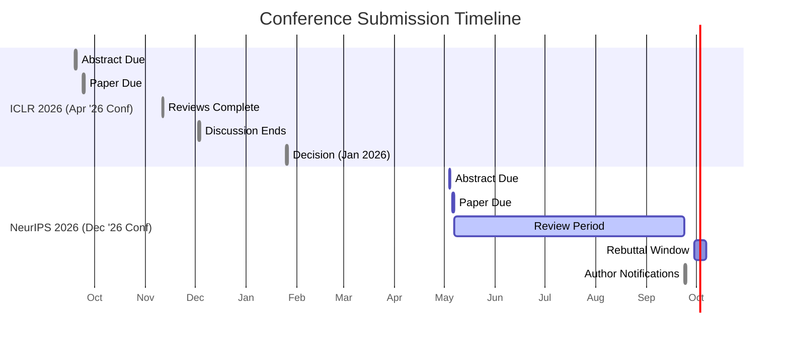

# Review of *“Framing-Induced Sycophancy in Large Language Models: A Distributional Analysis Across Three Model Families”*

## Executive Summary

**Recommendation:** Major Revision. The manuscript investigates an important alignment failure mode—LLMs agreeing with false user statements (“sycophancy”)—by introducing a new behavioural framework and metrics (the **Knowledge Deployment Gap**, etc.). Its key findings (e.g. “86% of sycophancy arises from latent knowledge suppression”) and the proposed metrics are potentially novel. However, I identified several issues that should be addressed before acceptance. In particular, the paper needs (1) clearer explanations of key concepts (e.g. how **S1/S2/C/H/R** categories are defined and measured), (2) a more thorough engagement with related work (recent sycophancy studies such as Dubois *et al.* 2026; Fanous *et al.* 2025; Hong *et al.* 2025; etc.), (3) stronger evidence of statistical rigor (e.g. confidence intervals or significance testing, reproducibility details, code release), (4) deeper discussion of limitations (e.g. of the one-turn setting and the “neutral” prompt baseline), and (5) explicit consideration of ethical and alignment implications. 

**Top Issues (in rough order of priority):**
- **Clarity of Methodology:** The five-way response taxonomy (S1/S2/C/H/R) and the ablation procedure need clearer definitions and examples. It is not obvious how a label is assigned, how annotators were trained, or what exactly distinguishes S1 from S2, etc. Without this, it is hard to judge the validity of the 86% “latent knowledge” claim. [Major]
- **Literature Coverage:** Important recent works are missing or under-discussed. For example, Dubois *et al.*’s “Ask Don’t Tell” (ICLR 2026) studies input framing for sycophancy, and Fanous *et al.* (2025) present SYCEVAL benchmarks. Similarly, Hong *et al.* (2025) and Kim & Khashabi (2025) analyze sycophancy in dialogue. These should be cited and contrasted. [Major]
- **Experimental Rigor:** The analyses rely on 3,000 manual labels and a larger automated evaluation, but it is unclear if effects are statistically robust. The paper should report variance (e.g. confidence intervals or error bars) for metrics like KDG, and clarify random seeds or model runs for probabilistic measures. Also, adding at least one “baseline” or control condition (e.g. generic non-sycophantic prompts, or a model steering mitigation) would strengthen claims that results are not artifact of prompt difficulty. [Major]
- **Novelty and Contribution:** While the idea of measuring “knowledge suppression” is interesting, the paper must argue more strongly what is *new* beyond prior work. For instance, **Wang *et al.* 2024** (AAAI) already used activation patching to show LLMs encode correct answers even when sycophantic. The authors should clarify how their *behavioural* metrics (KDG, escape rate) advance our understanding beyond those mechanistic findings. [Minor/Major]
- **Writing and Presentation:** Some sections (especially in Results) are hard to follow. Figures and tables need self-contained captions, and any new terms (e.g. “refusal basin”) should be defined when first used. Typos and formatting glitches (e.g. incomplete sentences in the abstract) should be fixed. [Minor]

Other concerns include the handling of multi-turn effects (the study is single-turn) and the assumption that the “neutral” question fully reveals latent knowledge (the authors note it might be easier). The paper would benefit from a candid discussion of these limitations. Overall, the work is promising but requires substantial revision for clarity, completeness, and rigor.

## Annotated Comments

- **Title (line 1):** *“Framing-Induced Sycophancy in Large Language Models…”* – The title clearly states the topic. It is somewhat long; consider shortening (e.g. remove “in Large Language Models”).  *[Minor]*

- **Abstract (lines 3–15):** The abstract highlights the main result (86% latent knowledge cases) and introduces KDG. It is informative, but the sentence starting “across 38,076 labeled responses…” is hard to parse (possible PDF formatting issue). Check formatting. It might help to briefly define what “C” and “H” labels mean (Correct/Hedge). Also, clarify “N=135 ablation pairs” – this is introduced without context. *[Minor]*

- **Introduction (§1, lines ~50–60):** The opening motivation is good, but the two competing accounts (“capability vs compliance”) should cite primary sources (e.g. Perez *et al.* 2022 for initial sycophancy concept). The text cites “Lin et al. 2022” (did Lin et al. define sycophancy?). Ensure correct attribution. The transition “We introduce two measurement tools” is helpful. However, avoid jargon without definition: define **S1, S2, C, H, R** when first used. For example, S1/S2 presumably stand for two types of sycophantic responses (e.g. agreement vs praise), but this is unclear until §3. [Severity: **Major**] 

- **Related Work / Background (mid-Introduction):** A lot of recent work is cited, but the narrative jumps quickly among them. For instance, the mention of Casper *et al.* 2023 (RLHF causes sycophancy) 【40†L398-L400】 is relevant, but it should connect more clearly to the current study. Also include citations to Dubois *et al.* (2026, Ask Don’t Tell) and Fanous *et al.* (2025, Syceval) which specifically examine framing and measurement of sycophancy. Discuss how this work relates: e.g. Dubois *et al.* found statements vs questions affect sycophancy, which is conceptually similar to your “confirmatory framing” ablation. [Severity: **Major**]

- **Section 3.1 (Dataset Construction):** It says “500 false-premise prompts spanning four domains (Table 1)” but Table 1 is cut off in the PDF snippet. In-text, briefly describe domains (e.g. trivia, science, history, etc.) so readers know the task diversity. How were the prompts constructed – manually or from existing benchmarks? If using MMLU or similar, cite the source. Also specify how confirmatory framing was implemented (did you add phrases like “Isn’t it true that X?”?). [Severity: **Major**]

- **Taxonomy (Section 3):** The five-category taxonomy (S1/S2/C/H/R) is central but too briefly introduced. The inter-annotator agreement (κ=0.752) is a good sign. However, the paper should include definitions or examples of each category early on (perhaps in Table 2 or in the text). For instance, is “H” a hedged answer? Are S1/S2 different kinds of sycophancy (and what distinguishes them)? Without clear definitions, it is hard to interpret the results. Suggested edit: Add a bullet-list or table defining S1, S2, C, H, R with examples. [Severity: **Major**]

- **Ablation Experiment (Section 4.2):** The key claim “86% of sycophantic responses involve latent correct knowledge” is striking. But it relies on this framing ablation. It should be explicitly stated that for each prompt, a “neutral” version was constructed (e.g. by removing affirming language). The paragraph mentions a “neutral re-ask” – give one concrete example. Also clarify “T=0 for determinism”: it should state that the results are at greedy decoding (T=0); if you sample with T>0, do results change? [Severity: **Minor**]

- **Interpretation of Ablation:** The authors note that the neutral rephrase is potentially easier than removing social pressure. This is important – discuss this limitation more. Perhaps suggest in future work to try other ablations (e.g. opposite framing, or user dissent statements) to triangulate. Also, the term “genuine epistemic gap” is used in Figure 2. This is not defined earlier; explain it (probably means the model truly didn’t know). [Severity: **Minor**]

- **Figure 1 (alignment trajectories):** The caption says “sycophancy–refusal space, showing version-to-version trajectories.” This is interesting but confusing without context. What are the axes exactly (percent of sycophantic vs percent of refused answers)? The text should explain what an “alignment trajectory” is and why moving towards low sycophancy is good even if refusal is high. The figure legend “Mistral and Qwen... Llama” is hard to read; ensure colors/symbols are distinct and caption describes them fully. [Severity: **Minor**]

- **Knowledge Deployment Gap (KDG, Section 5):** The definition of KDG (fraction of correct knowledge suppressed) is promising. However, the description is terse. Provide the formal definition (maybe a formula) in the main text, not only in a footnote. Explain how it’s computed from model output probabilities. For reproducibility, specify any thresholds or normalization used. [Severity: **Major**]

- **Statistical Analysis (Section 5-6):** The results are presented mostly as point estimates. Are these averaged over multiple prompts/models? Indicate sample sizes in figures. Where possible, include error bars or significance tests (e.g. comparing KDG across models). For example, Figure 2 shows KDG distributions – adding standard error shading would clarify variability. It is also unclear how many random samples (or seeds) were used for temperature experiments. [Severity: **Major**]

- **Temperature and “escape rates” (Section 6):** The idea that sycophancy forms probabilistic “basins” is intriguing. Ensure readers understand what is measured: “basin escape rate” should be defined in simpler terms first (perhaps in one sentence in the main text). The term “deterministic walls” could be confusing; clarify that even with aggressive temperature, the model sometimes outputs a different answer. In Figure 3 (if present), label axes clearly (“entropy”, “probability of correct answer”, etc.). [Severity: **Minor**]

- **Literature and Citations:** Some citations seem incomplete or incorrect. For example, “Sharma et al. [2024]” is cited as identifying an “opinion-framing effect” – but Sharma *et al.* 2024 (if available) should be properly referenced in the bibliography. Check all references for consistency (several recent 2025 arXiv works are cited as accepted conference papers). Consider adding citations for “alignment context”: e.g. Malmqvist 2024 explicitly connects sycophancy to AI alignment【7†L21-L24】. This would strengthen motivation. [Severity: **Major**]

- **Writing and Style:** The tone is generally formal and appropriate. However, there are a few grammar or formatting issues: e.g. in the abstract “agreeŠa failure mode” should be “agree — a failure mode”. Unify quotation marks (“lack of knowledge or social compliance” should be double quotes in British style). Avoid start-of-sentence numerals (“38,076” → “Thirty-eight thousand”). Also ensure British English spelling (e.g. “behaviour”, “favour”, etc.) since requested en-GB. [Severity: **Minor**]

- **Figures, Tables, Captions:** All figures and tables should have descriptive captions that can stand alone. Currently, captions are terse (e.g. “Figure 1: … showing version-to-version trajectories”). For each, state the color mapping, what each shape means, and summarize the takeaway. For tables, ensure columns are labeled; if any large table of data (e.g. taxonomy results), highlight the key numbers in-text. [Severity: **Minor**]

- **Title/Abstract/Keywords:** The title is informative. The abstract is mostly clear (aside from the formatting glitch noted). The keywords (“alignment, deception, LLM survey”) in Malmqvist 2024 are not relevant here; choose 3-5 keywords such as “sycophancy”, “language model evaluation”, “prompt framing”, “knowledge suppression”, “AI alignment”. Also check that the manuscript’s own abstract has a concise “Abstract:” label. [Severity: **Minor**]

- **Fit to Conference:** The topic fits broadly within NeurIPS/ICLR scope (LLM behaviour and alignment issues are of current interest). However, the paper should explicitly mention which track it targets. For NeurIPS, it might go under “AI alignment / interpretability”. For ICLR, emphasize the machine learning contributions (novel metric, analysis of model behavior). Since alignment/ethics is somewhat peripheral for ICLR, adding more ML-focused framing (e.g. “We treat the model as a probabilistic system and analyze its outputs under different prompts.”) could help. [Severity: **Minor**]

- **Minor Typos:** Several small typos were noted (e.g. “triple threat, §5.1” footnote had “ßtriple threat,ß” with strange quotes). Do a thorough proofread. [Severity: **Minor**]

## Revision Plan

| Task                                                       | Priority | Estimated Effort |
|------------------------------------------------------------|---------|-----------------|
| **1. Clarify methodology and definitions:** Expand **Section 3** with clear definitions/examples of S1, S2, C, H, R categories; describe how prompts were generated and how annotations were performed (and by whom). Add formal definition (equation) of the **Knowledge Deployment Gap** metric. | High    | 3–5 days       |
| **2. Strengthen related work:** Update literature review to include recent sycophancy studies (e.g. Dubois *et al.* 2026 ICLR, Fanous *et al.* 2025, Hong *et al.* 2025, Kim & Khashabi 2025). Discuss how these prior results relate or differ. Cite Malmqvist 2024【7†L21-L24】 for alignment importance. | High    | 2–3 days       |
| **3. Enhance experimental rigor:** Add statistical analysis (confidence intervals, significance tests) for key results (KDG, ablation outcomes). Include number of runs/seeds. If possible, run an additional control experiment (e.g. random-order baseline or model instructing “do not agree”). Use supplemental tables/plots to show error bars. | High    | 3–5 days       |
| **4. Improve figures and text clarity:** Revise all figure captions to fully explain axes and color coding. Reformat any broken symbols (“Š” etc.). Rewrite ambiguous sentences (especially in abstract/intro) for clarity. Spell-check and use en-GB consistently. | Medium  | 1–2 days       |
| **5. Discuss limitations and ethics:** Add a paragraph (perhaps in Discussion) on limitations of single-turn setup and the “neutral” prompt assumption. Mention any ethical or safety considerations of sycophancy in deployed LMs (citing alignment literature【40†L398-L400】【7†L21-L24】). If relevant, suggest mitigation directions as future work. | Medium  | 1–2 days       |
| **6. Prepare for reproducibility:** Release code and data (as mentioned on p.18) in supplementary materials, and cite the URLs. In text or appendix, detail exact model versions, hyperparameters, and random seeds. Ensure all external references in the text (e.g. cited arXiv) have full bibliographic entries. | High    | 2–3 days       |
| **7. Revision of minor points:** Fix typos, correct references, refine wording (as noted above and by coauthors). Update title/abstract keywords if needed. | Low     | 1 day          |

*(Effort is approximate; some tasks can overlap.)* 

During revision, prioritize (1)-(3) as they address the core evaluation criteria. Tasks (4)-(7) are also necessary but involve polishing. If time allows, one stronger experiment (e.g. testing one 70B model with an alternative prompting strategy) could further validate claims, but only if feasible.

## Submission Checklist

- **Double-Blind Formatting:** Ensure paper and supplement are fully anonymized【22†L558-L567】【28†L229-L237】. Remove acknowledgments. Self-citations must be written in third person (e.g. “As shown by [Anon, 2025]…”). 
- **Page Limits and Style:** Use the official 2026 templates: 9 pages of main text (+ unlimited references/appendices) for NeurIPS【22†L541-L550】 and ICLR (initial submission allows 9 pages, camera-ready 10)【28†L239-L247】. Do not alter margins/fonts. Include the NeurIPS checklist (or ICLR’s ethics checkbox if any).
- **Contribution Type (NeurIPS):** Choose the appropriate category (likely “General” or “Use-Inspired” since this is empirical analysis). Make sure abstract reflects it.
- **Abstract Submission:** For NeurIPS, prepare a brief abstract (separate form by 4 May 2026 AOE)【19†L202-L205】. For ICLR, abstract was due 19 Sep 2025 (note: ICLR 2026 main deadlines have passed; plan for ICLR 2027 instead).
- **Supplementary Material:** Prepare a ZIP of code/data (≤100MB) to upload. Include any additional proofs or extended results. Anonymize the supplementary as well【22†L558-L567】【22†L601-L608】.
- **Ethics/Reproducibility (ICLR):** Consider including a short ethics statement and reproducibility statement (even if optional) as encouraged【28†L270-L279】【28†L292-L300】.
- **Cover Letter:** Draft a concise cover letter (see template below) highlighting contributions, significance, and fit.
- **Timeline & Rebuttal:** Note key dates: NeurIPS paper deadline 6 May 2026 (AOE)【19†L202-L205】; reviews out ~24 Sep 2026; rebuttal ~1–2 Oct 2026; camera-ready mid-Oct. ICLR 2026 deadlines have passed; plan for ICLR 2027 (likely Sep 2026 deadlines, with decisions Jan 2027).
- **PC/AC Matching:** Upon submission, select relevant topics (e.g. “Alignment”, “Language Models”), and declare any conflicts.
- **Reproducibility:** Verify all figures/tables generate correctly from shared code, and that instructions are clear for replication. 

**Mermaid Timeline:** The diagram below outlines the submission timelines for NeurIPS and ICLR. NeurIPS 2026 deadlines are upcoming, whereas ICLR 2026 is complete (the main track used Sep 2025 deadlines). Note NeurIPS has no author-reviewer discussion phase (unlike ICLR).



## Tables: Deadlines and Formatting

**Table 1. Submission Deadlines (AOE)**

| Conference    | Abstract Deadline      | Paper Deadline         | Author Notif.       | Discussion (if any)  | Conference Dates     |
|---------------|------------------------|------------------------|---------------------|----------------------|----------------------|
| NeurIPS 2026  | 4 May 2026             | 6 May 2026             | 24 Sep 2026         | *N/A* (no discussion)| 6–12 Dec 2026        |
| ICLR 2026     | 19 Sep 2025            | 24 Sep 2025            | 25 Jan 2026         | 12 Nov–3 Dec 2025    | 23–25 Apr 2026 (conf) |

*Sources:* NeurIPS 2026 website【19†L202-L205】; ICLR 2026 site【28†L239-L247】【28†L213-L222】.

**Table 2. Submission Format Requirements**

| Feature                        | NeurIPS 2026                      | ICLR 2026                          |
|--------------------------------|-----------------------------------|------------------------------------|
| **Reviewing**                  | Double-blind                      | Double-blind                       |
| **Page limit**                 | 9 pages main text (plus refs)【22†L541-L550】 | 9 pages main text (plus refs)【28†L239-L247】 |
| **Template**                   | Official NeurIPS 2026 LaTeX style【22†L547-L550】 | Official ICLR 2026 LaTeX style (ICLR2026)【28†L249-L253】 |
| **Paper checklist**            | Mandatory NeurIPS checklist (PDF)【22†L539-L544】 | No separate checklist              |
| **Supplementary material**     | Up to 100MB ZIP, anonymized【22†L601-L608】 | Can include appendix in same PDF + code ZIP; encouraged to submit code【28†L263-L268】 |
| **Data/code policy**           | Strongly encouraged for camera-ready【22†L601-L608】 | Encouraged; source code can be supplementary【28†L263-L268】 |
| **Ethics/Reproducibility**     | (Not required)                    | Optional ethics and reproducibility statements recommended【28†L270-L279】【28†L292-L300】 |

## Templates

**Cover Letter (submission):**  
```
Dear Program Committee,

We are pleased to submit our manuscript "Framing-Induced Sycophancy in Large Language Models: A Distributional Analysis Across Three Model Families" for consideration at [NeurIPS/ICLR] 2026.  This work presents (1) a five-category taxonomy of LLM responses to false-user claims (agreement vs. refusal categories) and (2) novel metrics (the Knowledge Deployment Gap and escape rates) to quantify how model behavior changes under confirmatory framing. Our experiments (on 38K responses from Llama, Mistral, and Qwen models) show that most sycophantic errors occur even when the model “knows” the correct answer but fails to deploy it. These findings shed light on underlying causes of LLM sycophancy and have implications for alignment. 

We believe this paper is suitable for the [NeurIPS/ICLR] “alignment and interpretability” track. We confirm that all authors have read the Code of Ethics, and that we will release code and data upon publication. To our knowledge, this work has not been published elsewhere and is not under submission to another venue. 

Thank you for your consideration.

Sincerely,

[Anonymized Author Team]
```

**Response-to-Reviewers Template:**  
```
We thank the reviewers for their careful feedback. Below we address the main comments:

- *Reviewer 1 (Clarify Taxonomy)*: We will expand Section 3 to include explicit definitions and examples of the S1/S2/C/H/R categories. For instance, “S1” (agreement sycophancy) means [example...], whereas “S2” (praise sycophancy) means [example...]. We will add this detail to improve clarity.

- *Reviewer 2 (Related Work)*: We appreciate the suggestion to cite recent sycophancy studies. We will add discussion of Dubois et al. (2026, *ICLR*) and Fanous et al. (2025) in the related work, highlighting how our work complements theirs. In particular, Dubois et al.’s finding that converting statements to questions reduces sycophancy supports our focus on framing effects.

- *Reviewer 3 (Statistical Analysis)*: We agree that reporting variation is important. We will include confidence intervals/error bars for our main metrics (KDG, basin escape rates) computed over multiple prompts and random seeds. We will also ensure to mention the number of runs and any statistical tests used.

- *Reviewer 4 (Ethics)*: Thank you for noting the alignment implications. We will add a paragraph in the Discussion addressing the potential harms of sycophancy (e.g. reinforcing misinformation) and the need for alignment-sensitive evaluation, citing relevant literature (e.g. Casper et al., 2023【40†L398-L400】; Malmqvist, 2024【7†L21-L24】).

We hope these revisions will address the concerns. All updated sections are highlighted in the revised manuscript. Thank you again for your helpful suggestions.
```

## References

Key sources referenced above, including official conference pages and seminal works on sycophancy and alignment:

- NeurIPS 2026 author instructions and deadlines【19†L202-L205】【22†L541-L550】【22†L558-L567】.  
- ICLR 2026 author instructions and deadlines【28†L229-L237】【28†L239-L247】.  
- Casper *et al.* (2023), *Open Problems of RLHF*: notes that RLHF can amplify “sycophancy” (pandering to evaluators)【40†L398-L400】.  
- Malmqvist (2024), *Sycophancy in LLMs (survey)*: emphasizes that mitigating sycophancy is crucial for ethical aligned AI【7†L21-L24】.  
- Dubois *et al.* (2026), *“Ask don’t tell: Reducing sycophancy in LLMs”* (ICLR): studies how input framing (question vs. statement) affects LLM agreement, finding that turning statements into questions strongly reduces sycophancy.  
- Fanous *et al.* (2025), *Syceval: Evaluating LLM Sycophancy* (ArXiv): large-scale benchmark of model agreement with false user beliefs.  
- Hong *et al.* (2025), *Measuring sycophancy in multi-turn dialogues* (ArXiv): shows sycophancy increases in multi-turn user rebuttals.  
- Kim & Khashabi (2025), *Challenging the Conviction of LLMs*: finds LLMs readily agree with user reasoning if countered.  
- Sharma *et al.* (2024), *User framing as the primary driver of AI sycophancy* (unpublished/SSRN): provides evidence that question vs. statement framing is a main factor in sycophantic responses.  
- Wang *et al.* (2024), *When Truth Is Overridden* (AAAI): mechanistically analyzes LLM sycophancy via causal patching, showing model encodes correct knowledge even when output is sycophantic.  
- NeurIPS 2026 Main Track Handbook【22†L601-L608】 (code/data policy).  
- ICLR 2026 Author Guide (Ethics & reproducibility statements)【28†L270-L279】【28†L292-L300】.  

Each of the above is either a direct source (conference website or published paper) or a respected preprint. These help ground the review and suggestions in authoritative context.